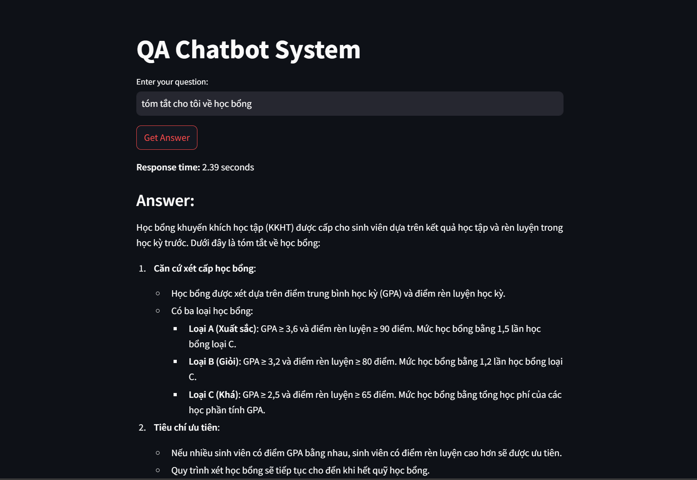

# Long text Q&A based on RAPTOR (Recursive Abstractive Processing for Tree-Organized Retrieval)
This is a question answering system code implementation.

[GitHub](https://github.com/parthsarthi03/raptor.git)
[Paper with code](https://paperswithcode.com/sota/question-answering-on-quality?p=raptor-recursive-abstractive-processing-for)


#  Advanced RAG chatbot with LLM, MILVUS, and Raptor Indexing

## Prerequisites

Before running the project, ensure you have the following prerequisites installed:

1. **Zilliz** cloud account: Milvus cloud Vector database 
2. **Python 3.12.5**: Ensure you have Python 3.x installed on your system.
3. **pip**: Ensure you have pip installed to manage Python packages.

## Setup

1. Clone the repository:
    ```sh
    git clone https://github.com/hainqh2506/QA_System.git
    cd .\QA_System\code
    ```

2. Create and activate virtual environment using anaconda or venv and install the required Python libraries:
    ```sh
    pip install -r requirements.txt
    ```

3. Create a Zilliz cloud account to use the Milvus database on the cloud.

4. Alternatively, you can create a local database by following the Milvus documentation:https://milvus.io/docs/install_standalone-docker-compose.md
- Download the script provided in the Milvus documentation to your project directory.
- Open your terminal, navigate to the project directory, and run:
- These will create and start the container

    ```sh
    docker-compose up -d
    ```
1. run streamlit app
    ```sh
    streamlit run pipeline.py
    ```



## Components

### 1. Data Ingestion
This component loads data from PDF files. It reads the content of the PDFs and splits them into manageable chunks for further processing.

### 2. Text Preprocessing and Creating Vector Embedding
This component preprocesses the ingested text data and creates vector embeddings. It involves tasks such as tokenization, removing stop words, and generating embeddings using models like SentenceTransformers.

### 3. Raptor Indexing and Implementing Collapsed Tree Retrieval
This component performs Raptor indexing on the text data to create hierarchical clusters. It implements collapsed tree retrieval for efficient search and summarization.

### 4. Creating Milvus vector Database
This component sets up the Milvus vector database to store and manage the text embeddings. It involves creating a connection, defining schemas, and inserting data into the database.


### 5. Retrieve Techniques and Reranking
Objective: To create a hybrid search that combines sparse retrievers with dense retrievers.
- **Creating Index**: Index the text embeddings stored in Milvus.
- **Creating Vector Store and Retriever**: Create a vector store and a retriever using the indexed data.
- **Using Reranking Algorithm**: Apply a reranking algorithm like CrossEncoder to refine the retrieved documents. (upcoming)

### 6. LLM for Question Answering
This component uses a Language Model (LLM) (chat GPT-4o-mini)to generate answers to user queries based on the context provided by the retrieved documents. It involves constructing prompts and invoking the LLM to generate accurate and relevant responses.

### 7. Future: adding routing and chat history (upcoming)

### 8. Video demo (upcoming)

### 9. Proposed system architecture

